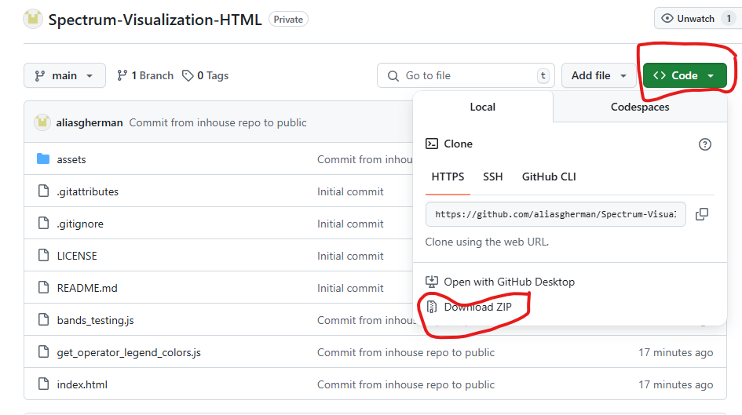
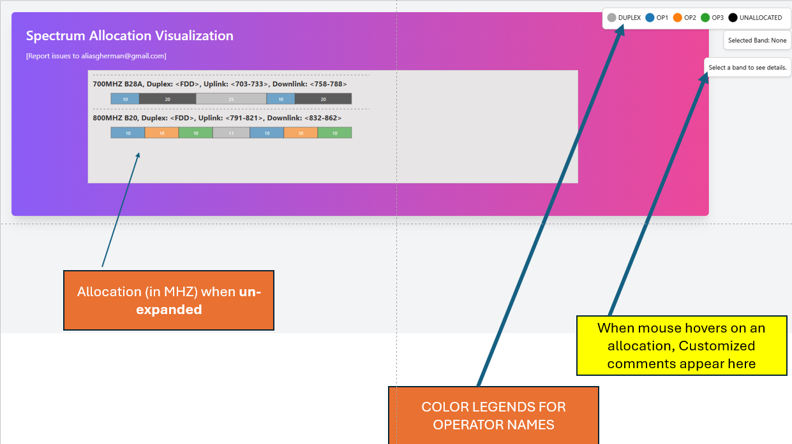
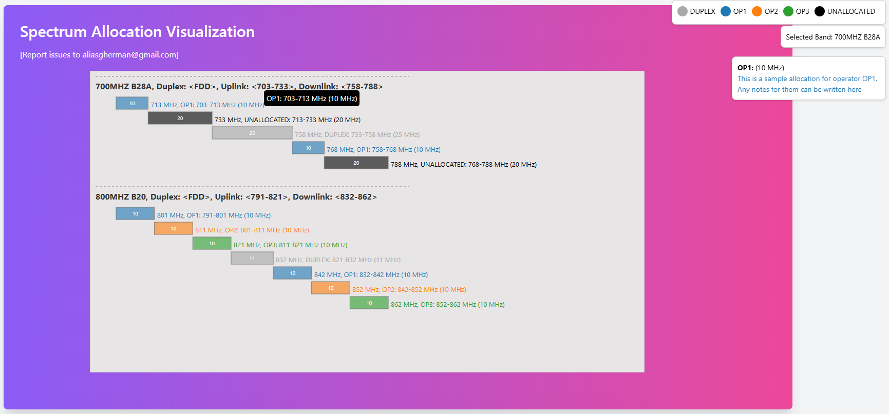

# Introduction

This project is a very simple, no-install html webpage which can be used to display spectrum allocations in a country/market.

Traditionally, the allocations are done in excel which means that interactivity is absent.

This interface is created specifically so that it can,

1. Run anywhere (it is a html page without hosting requirements and just double=click to open)
2. Easy to configure (Configure your bands and allocations in a single file. Format definitions below)
3. Easy to share (Share your bands_testing.js file with others and they can display the spectrum visualizations on their machines)
4. Can be hosted on a central server (You can also host this page so that your whole organization can access it)

# How to download

* Download the repo as a zip file (Or clone the repo)
    * In Github, you can find the download link like below,




# How to Configure

1. Open the file bands_testing.js
2. Add a Band and the band allocations for this specific band in the format below.

```javascript
const bands_input = [
    // BAND 700MHZ Details. Add allocations and uplink/downlink for any new bands in below format


    {
        // First line has the name and any information of this band and frequency start/end ranges

        name: "700MHz B28A", information: ``, uplink: [703, 733], downlink: [758, 788],
        
        // Just an indicator if this is FDD/TDD/SUL etc..
         type: "FDD", 

         // Do you want this band information to be expanded by default (watch visualization section below)
         expanded: false, 


         // How the allocation looks like per operator. Add your comments in the additionalinfo which will be displayed when you hover mouse on these bands

         allocations: [
            { operator: "OP1", start: 703, end: 713, additionalinfo: `This is a sample allocation for operator OP1. Any notes for them can be written here` },
            { operator: "UNALLOCATED", start: 713, end: 733, additionalinfo: `This is a sample unallocated block of spectrum` },
            { operator: "Duplex", start: 733, end: 758, additionalinfo: `Duplex can be optionally added to indicate the spectrum block which cannot be allocated in the FDD.` },
            { operator: "OP1", start: 758, end: 768, additionalinfo: `This is a sample allocation for operator OP1. Notes like license cost/expiry dates may be added here` },
            { operator: "UNALLOCATED", start: 768, end: 788, additionalinfo: `This is a sample unallocated block of spectrum` },
            ]
    },


    // Add more bands with same format here
    
];
```

# How to use

* Just double-click the file index.html once your band_testing.js has been configured with your own bands.
* Sample file is available in the repo

# Visualization

## Default View





## Expanded View with Mouse Hover

This is expanded view which shows the spectrum alongwith operator allocation in details as well as custom comments on the right side



# Acknowledgement

Like many other things in life, this tool would not have existed without boredom.